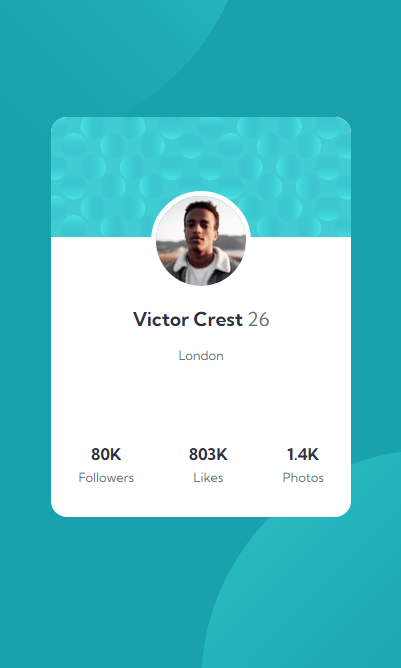
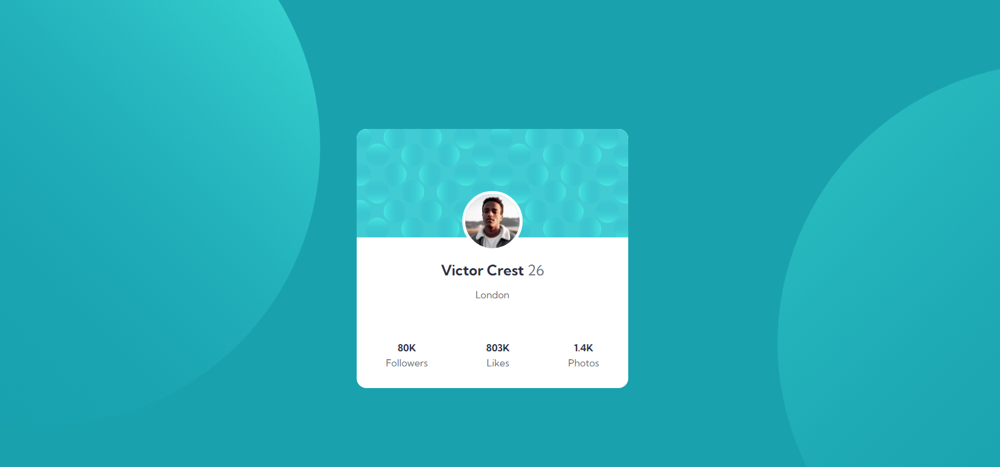

# Frontend Mentor - Profile card component solution

This is a solution to the [Profile card component challenge on Frontend Mentor](https://www.frontendmentor.io/challenges/profile-card-component-cfArpWshJ). Frontend Mentor challenges help you improve your coding skills by building realistic projects.

## Table of contents

- [Frontend Mentor - Profile card component solution](#frontend-mentor---profile-card-component-solution)
  - [Table of contents](#table-of-contents)
  - [Overview](#overview)
    - [The challenge](#the-challenge)
    - [Screenshot](#screenshot)
  - [Mobile](#mobile)
  - [Desktop](#desktop)
    - [Links](#links)
  - [My process](#my-process)
    - [Built with](#built-with)
  - [Author](#author)

## Overview

### The challenge

- Build out the project to the designs provided

### Screenshot

## Mobile

## Desktop

### Links

- Solution URL: (https://your-solution-url.com](https://www.frontendmentor.io/solutions/profile-card-component-UsS7XUV1mz)
- Live Site URL: (https://your-live-site-url.com](https://profile-card-component-ecru-one.vercel.app/)

## My process

### Built with

- Semantic HTML5 markup
- CSS custom properties
- SASS
- Flexbox
- Mobile-first workflow

## Author

- Linkedin - [Thalia Danielle](https://www.linkedin.com/in/thalia-danielle-21b968221/)
- GitHub - [Thalia Danielle](https://github.com/thaliadani)
- Frontend Mentor - [@thaliadani](https://www.frontendmentor.io/profile/thaliadani)
